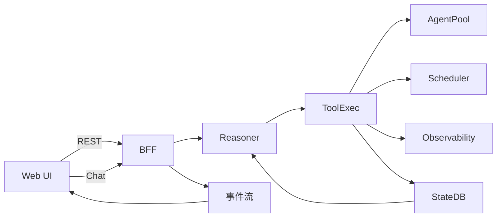
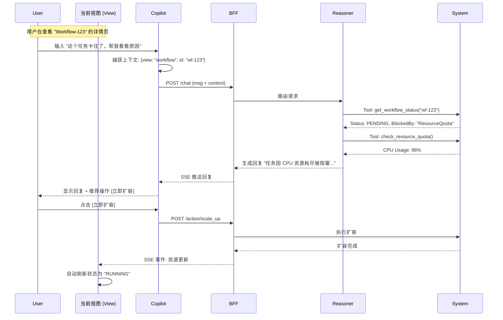
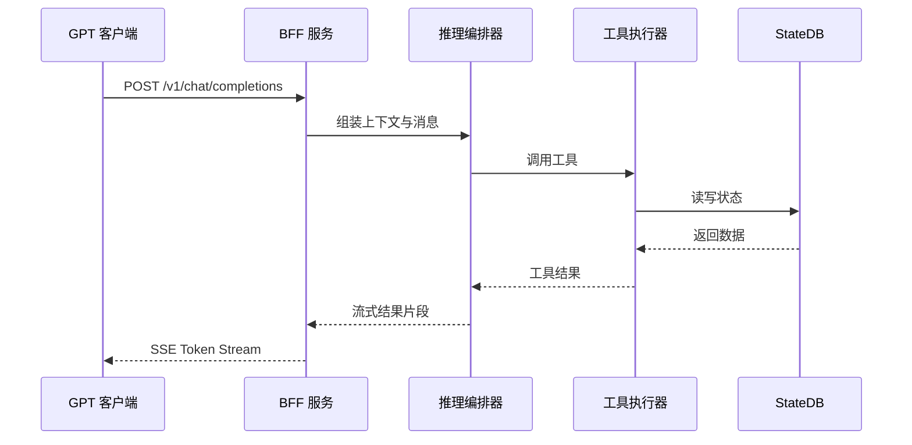
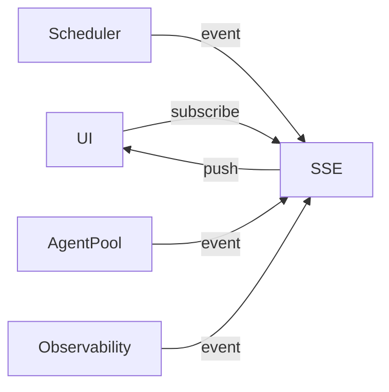
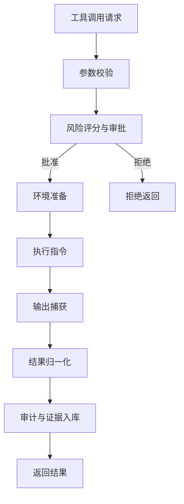
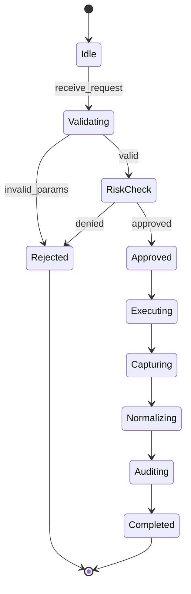
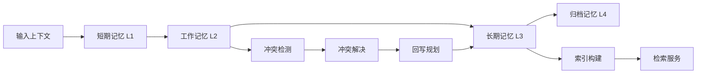
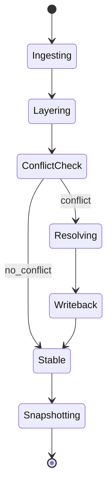
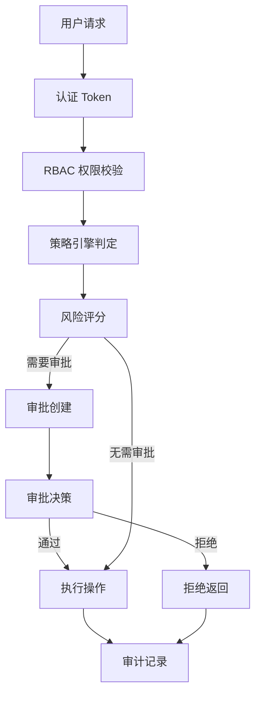
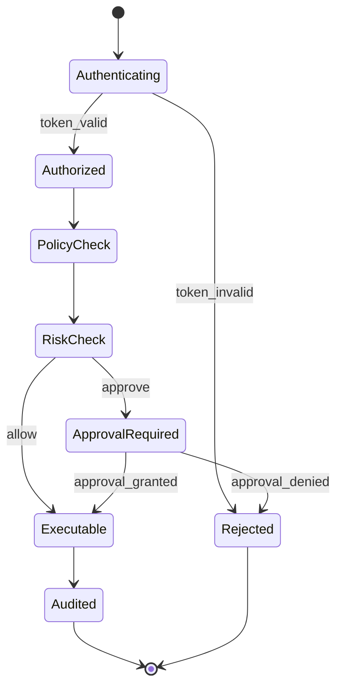

# MD2 X架构 Web管理后台与智能对话融合方案设计

## 1. 概述 (Overview)

本方案旨在构建 **MD2 X架构 (OpenClaw-X)** 的统一可视化指挥中心。它不仅仅是一个传统的管理后台，而是一个 **深度融合了智能对话能力 (LLM-Native)** 的下一代运维与编排平台。

### 1.1 核心理念：融合 (Fusion)
我们将智能对话能力从“附属聊天窗口”升级为“系统交互的核心驱动力”，实现 **GUI (图形界面) + LUI (语言界面)** 的双模态融合交互。

*   **所见即所问**: 在任何界面（如 Agent 列表），AI 自动感知当前上下文，用户可直接针对当前视图提问（“这个 Agent 为什么挂了？”）。
*   **所说即所得**: 用户的自然语言指令（“帮我扩容 Agent 池”）直接转化为系统操作，并实时反馈到 GUI 上。
*   **全链路汉化**: 基于 X架构的本地化设计，从界面到 AI 回复全中文支持。

---

## 2. 总体架构设计 (System Architecture)

### 2.1 融合架构图

```mermaid
graph TD
    User[用户 (User)] -->|HTTPS / WSS| WebUI[Web 控制台 (Vue3/React)]
    
    subgraph "前端融合层 (Frontend Fusion Layer)"
        WebUI -->|GUI Action| Views[视图组件 (Dashboard/Workflow/Agents)]
        WebUI -->|LUI Action| Copilot[智能副驾驶 (Copilot Sidebar)]
        
        Views <-->|Context Sync| Copilot
        Note right of Copilot: 实时感知视图状态 (State Awareness)
    end
    
    subgraph "BFF 接入层 (BFF Service)"
        Views -->|REST API| API_Mgmt[管理接口]
        Copilot -->|Chat API| API_Chat[对话接口 (/v1/chat/completions)]
        
        API_Mgmt -->|Events| SSE_Stream[统一事件流 (SSE)]
        API_Chat -->|Reasoning| SSE_Stream
        
        SSE_Stream -->|Push| WebUI
    end
    
    subgraph "智能核心 (Intelligence Core)"
        API_Chat -->|Route| Reasoning[Reasoning Orchestrator]
        Reasoning -->|Inject| ContextMgr[上下文管理器]
        ContextMgr -->|Fetch| StateDB[(State DB)]
        
        Reasoning -->|Tool Call| ToolExe[工具执行器]
    end
    
    subgraph "X架构后端 (Backend Modules)"
        ToolExe -->|Control| AgentPool[Agent Pool]
        ToolExe -->|Schedule| Scheduler[Scheduler]
        ToolExe -->|Query| Observability[Observability]
        
        API_Mgmt --> AgentPool
        API_Mgmt --> Scheduler
    end
```

### 2.2 核心模块融合说明

1.  **统一 BFF (Backend for Frontend)**:
    *   `bff_service.py` 将作为唯一的 API 网关，同时处理 REST API 请求（传统的 CRUD）和 Chat API 请求（智能对话）。
    *   **融合点**: 共享鉴权 (Auth/RBAC) 和 日志审计 (Audit)，确保无论是点击按钮还是发送指令，都受到同一套安全策略管控。

2.  **上下文感知 (Context Awareness)**:
    *   前端会将当前页面的状态（如 `current_view: "agent_detail"`, `selected_id: "agent-007"`）作为 `system_prompt` 的一部分发送给后端。
    *   **效果**: 用户只需说“重启它”，AI 就知道“它”指的是 Agent-007。

3.  **双向数据流 (Bi-directional Data Flow)**:
    *   **AI -> GUI**: AI 执行工具（如 `update_config`）后，通过 SSE 推送变更事件，前端 GUI 自动刷新，无需用户手动刷新。
    *   **GUI -> AI**: 用户在 GUI 上的操作（如手动暂停任务）会生成一条“系统消息”插入对话历史，让 AI 知道发生了什么。

---

### 2.3 X架构模块映射与职责

| X架构模块 | 职责 | 对应实现 |
| --- | --- | --- |
| BFF 服务 | Web 管理后台统一入口、REST 与 Chat 统一编排 | [bff_service.py](file:///home/maco_six/.openclaw/workspace/Training_Manual/MD2/code/services/bff_service.py) |
| 推理编排 | 任务分解、策略路由、多策略推理 | [orchestrator.py](file:///home/maco_six/.openclaw/workspace/Training_Manual/MD2/code/core/reasoning/orchestrator.py) |
| 模型路由 | 选择推理路径与策略 | [model_router.py](file:///home/maco_six/.openclaw/workspace/Training_Manual/MD2/code/core/central_brain/model_router.py) |
| 协议层 | 统一接口契约与数据结构 | [interfaces.py](file:///home/maco_six/.openclaw/workspace/Training_Manual/MD2/code/protocols/interfaces.py) |
| 消息总线 | 事件投递与订阅 | [message_bus.py](file:///home/maco_six/.openclaw/workspace/Training_Manual/MD2/code/core/message_bus/message_bus.py) |
| 持久化 | 运行状态与审计数据存储 | [state_db.py](file:///home/maco_six/.openclaw/workspace/Training_Manual/MD2/code/core/persistence/state_db.py) |
| 工作流协议 | 工作流定义与编排 | [workflows.py](file:///home/maco_six/.openclaw/workspace/Training_Manual/MD2/code/protocols/workflows.py) |

### 2.4 核心调用链路图



---

## 3. 功能模块详解

### 3.1 仪表盘 (Dashboard) - 全局态势感知
*   **GUI 功能**: 展示 CPU/内存水位、活跃 Agent 数、今日任务成功率。
*   **LUI 融合**:
    *   **智能异常分析**: 当红灯亮起时，点击“一键分析”，AI 读取 `observability` 模块的日志和指标，生成中文诊断报告。
    *   **自然语言查询**: “对比一下昨天和今天的任务量”，AI 调用数据分析工具生成 ECharts 图表配置。

### 3.2 编排中心 (Orchestrator) - 可视化与对话式编程
*   **GUI 功能**: 拖拽式 DAG 编辑器，管理 Workflow 定义。
*   **LUI 融合**:
    *   **对话式生成**: “帮我写一个爬取网页并总结的工作流”，AI 生成 JSON DAG，前端自动渲染为图形。
    *   **智能纠错**: “这个流程为什么跑不通？”，AI 分析 DAG 结构，指出循环依赖或参数缺失。

### 3.3 资源管理 (Agent Pool) - 智能运维
*   **GUI 功能**: Agent 列表、状态监控、日志查看。
*   **LUI 融合**:
    *   **批量操作**: “把所有空闲超过 1 小时的 Agent 关掉”，AI 识别筛选条件并调用 `agent_pool.scale_down()`。
    *   **日志对话**: 选中某个 Agent 的日志，直接问“这里报错是什么意思？”，AI 解释堆栈信息并给出修复建议。

### 3.4 安全与治理 (Governance) - 同源策略
*   **统一鉴权**: 所有对话与按钮操作统一走 Token 与 RBAC 校验。
*   **策略引擎**: 高风险操作触发审批流，审批完成后再执行。
*   **审计链路**: 以 TraceId 串联请求、模型决策、工具执行与结果回写。

---

## 4. 交互逻辑设计 (Interaction Logic)

### 4.1 智能副驾驶 (Copilot) 交互循环



### 4.2 中文本地化方案
1.  **界面汉化**: 使用 `vue-i18n`，所有 Label、Button、Tooltip 均配置中文。
2.  **AI 人格设定**: System Prompt 中预设：“你是一个专业的中文运维专家，请使用简洁、准确的中文回答，技术名词保留英文（如 Pod, Agent）”。
3.  **错误码转译**: BFF 层拦截所有 `HTTP 4xx/5xx`，通过 `ErrorPatternLibrary` 匹配并翻译为中文建议（如 `AuthFailed` -> “认证失效，请重新登录”）。

### 4.3 OpenAI 兼容交互时序



### 4.4 事件流机制图



---

## 5. 接口规范与协议 (API Spec)

### 5.1 统一 Chat 接口
**Endpoint**: `POST /v1/chat/completions`

**Request**
```json
{
  "model": "md2-reasoner-v1",
  "messages": [
    {"role": "system", "content": "你是 MD2 中文运维专家"},
    {"role": "user", "content": "帮我检查今天的审批积压"}
  ],
  "stream": true,
  "metadata": {
    "view": "approvals",
    "selected_id": ""
  }
}
```

**Response (Stream)**
```json
{"id":"cmpl-001","choices":[{"delta":{"content":"当前有 5 条待审批任务，主要集中在"}}]}
```

### 5.2 管理接口约定
*   `GET /v1/agents` Agent 列表
*   `GET /v1/runs` 运行实例
*   `GET /v1/approvals` 审批任务
*   `POST /v1/workflows` 工作流定义
*   `POST /v1/work-items` 工作项队列

### 5.3 SSE 事件结构
**事件名**: `update:agents | update:runs | update:dashboard | update:approvals`

**数据结构**
```json
{"event":"update:agents","timestamp":1700000000,"payload":{"changed":true}}
```

---

## 6. 核心代码片段（示意，非完整实现）

### 6.1 BFF 对话入口骨架

```python
from typing import Any, Dict, List

def handle_chat_request(body: Dict[str, Any], user: Dict[str, Any]) -> Dict[str, Any]:
    model = str(body.get("model", "md2-reasoner-v1"))
    messages = list(body.get("messages") or [])
    stream = bool(body.get("stream", True))
    metadata = dict(body.get("metadata") or {})
    ctx = build_context(user=user, metadata=metadata)
    return route_to_reasoner(model=model, messages=messages, context=ctx, stream=stream)
```

### 6.2 上下文构建与注入

```python
def build_context(user: Dict[str, Any], metadata: Dict[str, Any]) -> Dict[str, Any]:
    return {
        "user_id": str(user.get("user_id", "")),
        "roles": list(user.get("roles") or []),
        "view": str(metadata.get("view", "")),
        "selected_id": str(metadata.get("selected_id", "")),
    }
```

### 6.3 Prompt 组装器

```python
def build_system_prompt(ctx: Dict[str, Any]) -> str:
    return (
        "你是 MD2 中文运维专家，输出简洁中文，技术词保留英文。"
        f"当前视图: {ctx.get('view','')}, 选中对象: {ctx.get('selected_id','')}"
    )
```

### 6.4 工具注册与函数映射

```python
def get_tool_registry() -> List[Dict[str, Any]]:
    return [
        {"name": "list_agents", "inputs": ["status"], "outputs": ["agents"]},
        {"name": "get_run_status", "inputs": ["run_id"], "outputs": ["status"]},
        {"name": "list_approvals", "inputs": ["status"], "outputs": ["approvals"]},
    ]
```

### 6.5 工具执行器骨架

```python
def execute_tool(name: str, args: Dict[str, Any]) -> Dict[str, Any]:
    if name == "list_agents":
        return query_agents(args)
    if name == "get_run_status":
        return query_runs(args)
    if name == "list_approvals":
        return query_approvals(args)
    return {"error": "unknown_tool"}
```

### 6.6 SSE 流式输出格式

```python
def stream_chunk(chunk: str) -> str:
    payload = {"id": "cmpl-001", "choices": [{"delta": {"content": chunk}}]}
    return f"data: {json.dumps(payload, ensure_ascii=False)}\n\n"
```

---

## 7. 模块内流程与状态机（细颗粒）

### 7.1 ToolAdapter 内部流程图



### 7.2 ToolAdapter 状态机图



### 7.3 MemoryHub 数据流与一致性流程



### 7.4 MemoryHub 状态机图



### 7.5 Governance 授权与审批流程



### 7.6 Governance 状态机图



---

## 8. 实施路线图 (Roadmap)

### Phase 1: 基础融合框架 (The Framework)
*   搭建 Vue3 + Tailwind 脚手架。
*   实现基于 SSE 的全局事件总线。
*   集成 OpenAI 兼容的 Chat 组件，并打通上下文注入通道。

### Phase 2: 核心模块智能化 (Module Intelligence)
*   **Dashboard**: 对接 `observability` API，实现图表渲染。
*   **Agent**: 对接 `agent_pool` API，实现列表与操作。
*   **Chat**: 实现“查日志”、“查状态”的基础 Tool Use 能力。

### Phase 3: 高级意图与自动化 (Advanced Intent)
*   **Workflow Copilot**: 实现对话生成 DAG。
*   **Auto-Remediation**: AI 发现问题后主动通过 Toast 弹窗建议修复方案，用户点击即可执行。

---

## 9. 总结
本方案将 Web 控制台从单纯的“操作面板”升级为“智能驾驶舱”。通过 X架构的模块化设计，我们将 `Reasoning` 能力深度注入到每一个管理环节，实现了真正的 **AI-Native** 运维体验。
