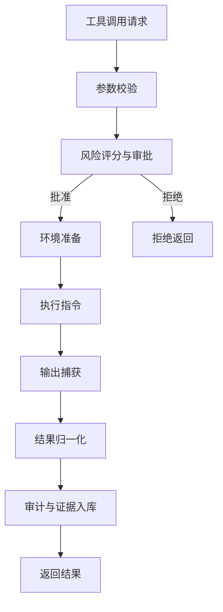
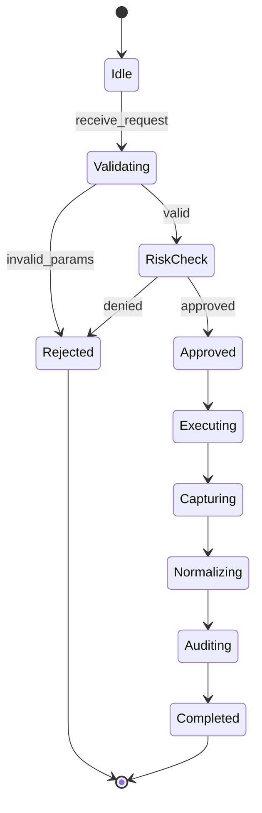
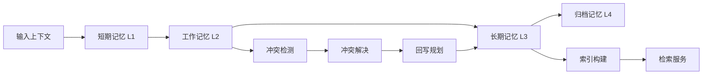
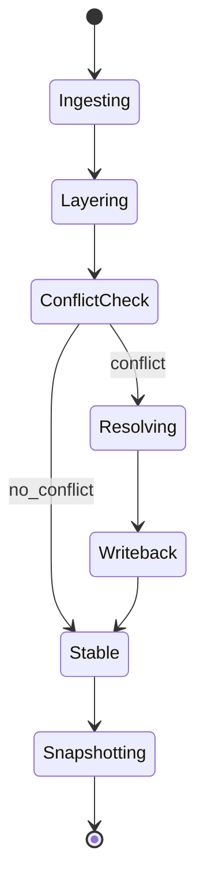
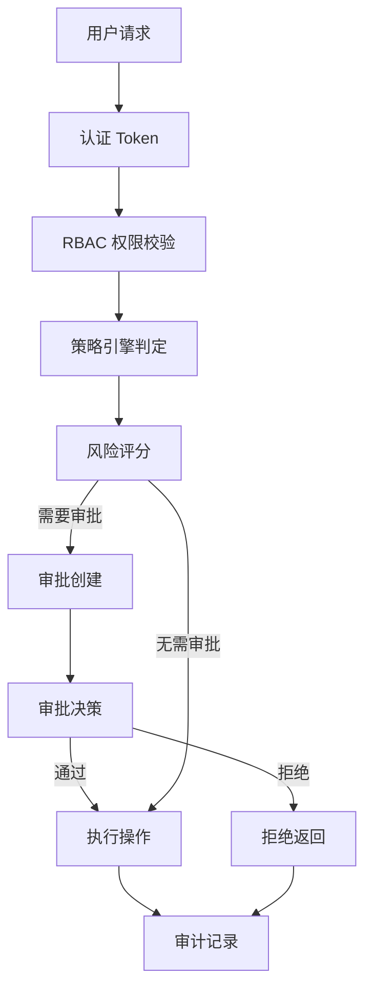
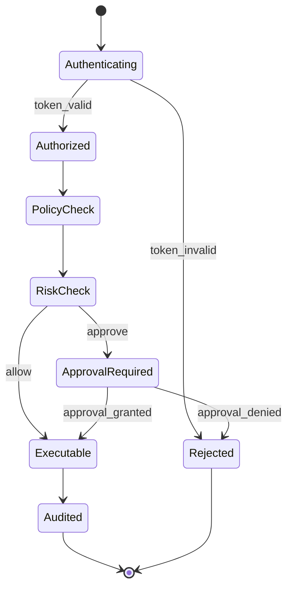

# OpenClaw-X 代码模块索引

## 概述

本文档索引了基于X架构完善的所有代码模块，按照架构层次组织。

---

## Web管理后台与智能对话融合方案

该方案已与 X 架构深度融合，覆盖 BFF 统一入口、Reasoning 编排、工具执行、治理与审计、以及全中文交互与 OpenAI 兼容接口设计。

- 方案主文档：[MD2_X_ARCH_WEB_CONSOLE_SCHEME.md](file:///home/maco_six/.openclaw/workspace/Training_Manual/MD2/MD2_X_ARCH_WEB_CONSOLE_SCHEME.md)
- 关键映射：BFF、Reasoning、ModelRouter、Governance、MemoryHub、ToolAdapter
- 细颗粒流程：ToolAdapter / MemoryHub / Governance 内部流程与状态机

### ToolAdapter 内部流程图



### ToolAdapter 状态机



### MemoryHub 数据流与一致性流程



### MemoryHub 状态机



### Governance 授权与审批流程



### Governance 状态机



---

## 目录结构

```
code/
├── core/                          # 核心模块层
│   ├── kernel/                    # 最小可用内核
│   │   ├── __init__.py
│   │   ├── kernel.py              # OpenClawKernel核心实现
│   │   └── adapter.py             # ToolAdapter/MemoryAdapter/ContextBus
│   │
│   ├── reasoning/                 # 推理增强层
│   │   ├── __init__.py
│   │   ├── strategy_router.py     # 策略路由器
│   │   ├── cot_injector.py        # CoT思维链注入
│   │   ├── tot_engine.py          # Tree-of-Thought思维树
│   │   ├── reflexion_engine.py    # Reflexion反思迭代
│   │   ├── self_consistency.py    # Self-Consistency自一致性
│   │   ├── scratchpad.py          # 工作记忆管理
│   │   ├── orchestrator.py        # 推理编排器
│   │   └── kg_reasoner.py         # 神经符号知识图谱推理
│   │
│   ├── central_brain/             # 中央机层
│   │   ├── __init__.py
│   │   ├── coordinator.py         # 中央机协调器
│   │   ├── scheduler.py           # 中央机调度器
│   │   ├── router.py              # 任务路由器
│   │   ├── model_router.py        # 模型路由器
│   │   ├── error_patterns.py      # 错误模式库
│   │   └── route_module.py        # 路由模块
│   │
│   ├── agent_pool/                # Agent池层
│   │   ├── __init__.py
│   │   ├── agent.py               # Agent实体与状态机
│   │   └── agent_pool.py          # Agent池管理
│   │
│   ├── message_bus/               # 消息总线层
│   │   ├── __init__.py
│   │   └── message_bus.py         # Pub/Sub消息总线
│   │
│   ├── api/                       # API层
│   │   ├── __init__.py
│   │   └── router.py              # API路由器
│   │
│   ├── eval_gate/                 # 评估门
│   │   ├── __init__.py
│   │   ├── gate.py                # 评估门模块
│   │   └── truth_gate.py          # 真值门
│   │
│   ├── memory_hub/                # 记忆中心
│   │   ├── __init__.py
│   │   ├── layered_hub.py         # 分层记忆中心
│   │   ├── layers.py              # 记忆层
│   │   ├── conflict_resolver.py   # 冲突解决器
│   │   ├── writeback.py           # 回写规划器
│   │   └── drift.py               # 漂移检测
│   │
│   ├── growth_loop/               # 成长循环
│   │   ├── __init__.py
│   │   ├── loop.py                # 成长循环主逻辑
│   │   ├── learner.py             # 学习器
│   │   └── idle_detector.py       # 空闲检测器
│   │
│   ├── metacognition/             # 元认知
│   │   ├── __init__.py
│   │   ├── loop.py                # 元认知循环
│   │   ├── cognitive_debt.py      # 认知债务账本
│   │   └── failure_library.py     # 失败模式库
│   │
│   ├── orchestrator/              # 编排器
│   │   ├── __init__.py
│   │   ├── dag.py                 # DAG定义
│   │   ├── executor.py            # 执行器
│   │   └── run_engine.py          # 运行引擎
│   │
│   ├── scheduler/                 # 调度器
│   │   ├── __init__.py
│   │   ├── engine.py              # 调度引擎
│   │   └── service.py             # 调度服务
│   │
│   ├── risk/                      # 风险评分
│   │   ├── __init__.py
│   │   └── scorer.py              # 风险评分器
│   │
│   ├── config/                    # 配置管理
│   │   ├── __init__.py
│   │   ├── store.py               # 配置存储
│   │   ├── rollback.py            # 配置回滚
│   │   └── feature_flags.py       # 特性开关
│   │
│   ├── governance/                # 治理层
│   │   ├── __init__.py
│   │   ├── auth.py                # 认证
│   │   ├── rbac.py                # RBAC权限
│   │   ├── audit.py               # 审计
│   │   ├── policy_engine.py       # 策略引擎
│   │   └── redaction.py           # 脱敏
│   │
│   ├── observability/             # 可观测性
│   │   ├── __init__.py
│   │   ├── tracing.py             # 链路追踪
│   │   ├── metrics.py             # 指标采集
│   │   ├── evidence.py            # 证据链
│   │   ├── event_bus.py           # 事件总线
│   │   └── persistent_bus.py      # 持久化总线
│   │
│   ├── recovery/                  # 恢复机制
│   │   ├── __init__.py
│   │   ├── idempotency.py         # 幂等处理
│   │   ├── replay.py              # 重放机制
│   │   └── startup.py             # 启动恢复
│   │
│   ├── persistence/               # 持久化层
│   │   ├── __init__.py
│   │   ├── state_db.py            # 状态数据库
│   │   ├── state_store.py         # 状态存储
│   │   ├── sqlite_store.py        # SQLite存储
│   │   ├── snapshot_store.py      # 快照存储
│   │   ├── jsonl_wal.py           # JSONL WAL
│   │   └── schema.py              # 数据库Schema
│   │
│   ├── skills/                    # 技能生态
│   │   ├── __init__.py
│   │   ├── registry.py            # 技能注册表
│   │   ├── loader.py              # 技能加载器
│   │   └── batch_ops.py           # 批量操作
│   │
│   ├── health/                    # 健康检查
│   │   ├── __init__.py
│   │   └── contract.py            # 健康契约
│   │
│   └── runtime/                   # 运行时
│       ├── __init__.py
│       ├── container.py           # 运行时容器
│       └── paths.py               # 路径管理
│
├── protocols/                     # 协议定义层
│   ├── __init__.py
│   ├── interfaces.py              # 核心接口契约
│   ├── events.py                  # 事件协议
│   ├── topics.py                  # 主题定义
│   ├── trace.py                   # 追踪协议
│   ├── workflow.py                # 工作流协议
│   ├── workflows.py               # 工作流定义
│   ├── approvals.py               # 审批协议
│   ├── learning.py                # 学习协议
│   ├── skills.py                  # 技能协议
│   ├── health.py                  # 健康协议
│   ├── risk.py                    # 风险协议
│   ├── config.py                  # 配置协议
│   ├── persistence.py             # 持久化协议
│   ├── api.py                     # API协议
│   └── bff.py                     # BFF协议
│
├── services/                      # 服务层
│   ├── __init__.py
│   ├── service_base.py            # 服务基类
│   ├── scheduler_service.py       # 调度服务
│   ├── orchestrator_service.py    # 编排服务
│   ├── runner_service.py          # 运行服务
│   ├── growth_loop_service.py     # 成长循环服务
│   ├── eval_service.py            # 评估服务
│   ├── memory_indexer_service.py  # 记忆索引服务
│   └── bff_service.py             # BFF服务
│
├── utils/                         # 工具层
│   ├── __init__.py
│   └── logger.py                  # 统一日志
│
├── examples/                      # 示例
│   ├── e2e_smoke.py               # 端到端冒烟测试
│   └── pipeline_demo.py           # 流水线演示
│
└── openclawd.py                   # 主入口守护进程
```

---

## 核心模块说明

### 1. Kernel (最小可用内核)

- **OpenClawKernel**: 核心执行引擎，提供工具适配、内存管理、上下文总线
- **ToolAdapter**: 命令执行、文件操作适配器
- **MemoryAdapter**: 内存存储适配器
- **ContextBus**: 上下文传播总线

### 2. Reasoning (推理增强层)

- **StrategyRouter**: 问题分类与策略选择
- **CoTInjector**: Chain-of-Thought思维链注入
- **TreeOfThoughtEngine**: Tree-of-Thought思维树展开
- **ReflexionEngine**: Reflexion反思迭代引擎
- **SelfConsistencySampler**: Self-Consistency自一致性采样
- **ScratchpadManager**: 工作记忆管理
- **ReasoningOrchestrator**: 推理统一编排入口

### 3. Central Brain (中央机)

- **CentralBrainCoordinator**: 任务协调与分发
- **CentralBrainScheduler**: 调度策略执行
- **TaskRouter**: 任务路由与Agent匹配
- **ModelRouter**: 模型路由决策
- **ErrorPatternLibrary**: 错误模式识别库

### 4. Agent Pool (Agent池)

- **Agent**: Agent实体，包含状态机、心跳、快照
- **AgentPool**: Agent池管理，支持注册、分发、状态监控

### 5. Message Bus (消息总线)

- **MessageBus**: Pub/Sub消息总线，支持订阅、发布、历史记录

### 6. Eval Gate (评估门)

- **EvalGateModule**: 评估门禁模块
- **TruthGate**: 真值门，事实校验机制

### 7. Memory Hub (记忆中心)

- **LayeredMemoryHub**: 分层记忆中心 (L1-L4)
- **ConflictResolver**: 记忆冲突解决
- **WritebackPlanner**: 回写规划

### 8. Growth Loop (成长循环)

- **GrowthLoop**: 空闲学习与技能沉淀
- **IdleDetector**: Agent空闲检测
- **Learner**: 自主学习器

### 9. Metacognition (元认知)

- **SimpleMetacognitionLoop**: 元认知自改进循环
- **CognitiveDebtLedger**: 认知债务账本
- **FailurePatternLibrary**: 失败模式库

---

### 10. Web管理后台与智能对话融合方案（嵌入版）

#### 10.1 BFF 统一入口（Chat + REST）

- **职责**: 统一承接 Web 管理后台的 REST API 与智能对话的 Chat API，复用鉴权、审计、事件流
- **关键模块**: [bff_service.py](file:///home/maco_six/.openclaw/workspace/Training_Manual/MD2/code/services/bff_service.py)
- **调用逻辑**: UI 请求 -> BFF -> Reasoning/Service -> SSE 推送 -> UI

#### 10.2 Reasoning + ToolAdapter（指令解析与工具执行）

- **职责**: 将自然语言意图转为工具调用，形成可审计的执行链路
- **关键模块**: [orchestrator.py](file:///home/maco_six/.openclaw/workspace/Training_Manual/MD2/code/core/reasoning/orchestrator.py)、[adapter.py](file:///home/maco_six/.openclaw/workspace/Training_Manual/MD2/code/core/kernel/adapter.py)
- **状态机**: 请求 -> 校验 -> 风险评分 -> 执行 -> 结果归一化 -> 审计

#### 10.3 MemoryHub（上下文与记忆管理）

- **职责**: 对话与系统状态的分层记忆管理，冲突检测与回写规划
- **关键模块**: [layered_hub.py](file:///home/maco_six/.openclaw/workspace/Training_Manual/MD2/code/core/memory_hub/layered_hub.py)、[conflict_resolver.py](file:///home/maco_six/.openclaw/workspace/Training_Manual/MD2/code/core/memory_hub/conflict_resolver.py)
- **核心流程**: L1/L2/L3/L4 分层 -> 冲突检测 -> 解决 -> 回写 -> 索引

#### 10.4 Governance（鉴权、策略、审计）

- **职责**: 对话与 UI 操作同源治理，统一 Auth/RBAC/Policy/Risk
- **关键模块**: [auth.py](file:///home/maco_six/.openclaw/workspace/Training_Manual/MD2/code/core/governance/auth.py)、[rbac.py](file:///home/maco_six/.openclaw/workspace/Training_Manual/MD2/code/core/governance/rbac.py)、[policy_engine.py](file:///home/maco_six/.openclaw/workspace/Training_Manual/MD2/code/core/governance/policy_engine.py)
- **闭环**: Token -> 权限 -> 策略 -> 风险 -> 审批 -> 执行 -> 审计

#### 10.5 事件流（SSE 与可观测性联动）

- **职责**: 实时推送系统事件（审批、运行、告警），AI 与 UI 双向同步
- **关键模块**: [event_bus.py](file:///home/maco_six/.openclaw/workspace/Training_Manual/MD2/code/core/observability/event_bus.py)

---

## 接口契约 (protocols/interfaces.py)

定义了所有核心接口：

- `IModule`: 模块基础接口
- `IToolAdapter`: 工具适配器接口
- `IMemoryAdapter`: 内存适配器接口
- `IContextBus`: 上下文总线接口
- `IReasoner`: 推理器接口
- `IEvalGate`: 评估门接口
- `IRiskScorer`: 风险评分接口
- `IAgentPool`: Agent池接口
- `IMessageBus`: 消息总线接口
- `IScheduler`: 调度器接口
- `IOrchestrator`: 编排器接口
- `IAuthProvider`: 认证接口
- `IConfigStore`: 配置存储接口
- `ISkillRegistry`: 技能注册接口
- `ITruthGate`: 真值门接口
- `IGrowthLoop`: 成长循环接口

---

## 服务架构

```
openclawd.py (主守护进程)
    ├── scheduler_service.py      # 调度服务
    ├── orchestrator_service.py   # 编排服务
    ├── runner_service.py         # 运行服务
    ├── growth_loop_service.py    # 成长循环服务
    ├── eval_service.py           # 评估服务
    ├── memory_indexer_service.py # 记忆索引服务
    └── bff_service.py            # BFF服务 (Web API)
```

---

## 使用示例

```python
from core.kernel import OpenClawKernel, KernelConfig
from core.reasoning import ReasoningOrchestrator, ReasoningConfig
from core.central_brain import CentralBrainCoordinator
from core.agent_pool import AgentPool

kernel = OpenClawKernel(KernelConfig(seed=42))
await kernel.initialize({})

reasoning = ReasoningOrchestrator(ReasoningConfig())
await reasoning.initialize({})

result = await reasoning.reason("计算 15% 的 240 是多少？")
print(result.answer, result.confidence)
```

---

**版本**: v1.0.0  
**最后更新**: 2026-02-13
