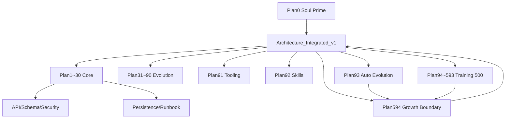

# Training_Manual 目录总文档（按上下文关联分类）

## 1. 总览
- 覆盖计划：Plan0~Plan594。
- 目标：构建可靠、聪明、高效、低能耗的游戏策划/设计全能助手。

## 2. 核心导航

### A. 顶层主控
- `Training_Manual/Plan0`
  作用：Soul Prime，上位约束，最高优先级。
- `Training_Manual/Architecture_Integrated_v1.md`
  作用：整体架构与阶段路线。
- `Training_Manual/Executable_List`
  作用：全局执行顺序与约束。

### B. 基础核心计划（Plan1~30）
- `Training_Manual/Plan1` ... `Training_Manual/Plan30`
  作用：心跳、记忆、治理、调度、控制台、搜索、记忆城堡等基础能力。

### C. 进化增强计划
- `Training_Manual/Plan31_90_Evolution_Pack.md`
  作用：进化增强专题总包。
- `Training_Manual/Plan91_Tooling_Safe_Stack.md`
  作用：安全工具栈。
- `Training_Manual/Plan92_Skills_Architecture_Stack.md`
  作用：技能体系。
- `Training_Manual/Plan93_Autonomous_Evolution_Reliable.md`
  作用：自动进化闭环。

### D. 训练体系
- `Training_Manual/Plan94_593_GameDesign_Training_Pack.md`
  作用：500条不重复训练计划（每条含目标/指标/任务/达成程度）。
- `Training_Manual/Plan594`
  作用：学习成长边界与稳定闭环。

### E. 合同与规范
- `Training_Manual/API_Contract_Run_NodeRun.md`
- `Training_Manual/Schema_Contract.md`
- `Training_Manual/Security_RBAC_Audit.md`
- `Training_Manual/Observability_Standard.md`
- `Training_Manual/Test_Baseline_Chaos.md`

### F. 运维与持久化
- `Training_Manual/Persistence_Final_Solution.md`
- `Training_Manual/Runbook_Scheduler_Orchestrator.md`
- `Training_Manual/ReDeploy_Deep_Mod_Solution.md`

### G. 全量独立详述
- `Training_Manual/Plan_Details/Plan0.md` ... `Training_Manual/Plan_Details/Plan594.md`
  作用：每个计划独立可执行说明，已分层差异化。

## 3. 上下文关联图

## 4. 阅读顺序
1. Plan0
2. Architecture_Integrated_v1
3. Executable_List
4. 合同文档（API/Schema/Security/Observability/Test）
5. Plan17/19/30/93/594
6. Plan94~593 与对应 Plan_Details

## 5. 维护约定
- 新增计划必须同步更新：
1. `Executable_List`
2. `Architecture_Integrated_v1.md`
3. `CATALOG.md`
4. `Plan_Details/Plan<id>.md`
